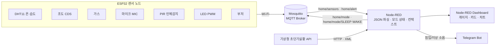

<div align="center">

# 🏠 ESP32 IoT Smart Home — HOME / AWAY / SLEEP

**ESP32 센서 노드 + MQTT + Node-RED 대시보드를 하나의 흐름으로 연결한 통합 스마트 홈 모니터링·수면 환경 분석 시스템**

단순 센서 값 표시를 넘어, 생활 패턴(재실 / 외출 / 수면)에 따른 **모드 기반 제어**, 경보 알림, 시각적 데이터 분석까지 한 흐름으로 잇는 것을 목표로 한다.

[](https://www.espressif.com/)
[](https://www.arduino.cc/)
[](https://mosquitto.org/)
[](https://nodered.org/)
[](https://flows.nodered.org/node/node-red-dashboard)
[](https://apihub.kma.go.kr/)
[](https://core.telegram.org/bots)

</div>

---

## 📋 목차

- [개요](#-개요)
- [팀 구성 · 역할](#-팀-구성--역할)
- [시스템 아키텍처](#-시스템-아키텍처)
- [하드웨어 구성](#-하드웨어-구성)
- [MQTT 토픽 & 데이터 포맷](#-mqtt-토픽--데이터-포맷)
- [동작 모드 — HOME / AWAY / SLEEP](#-동작-모드--home--away--sleep)
- [Node-RED 플로우](#-node-red-플로우)
- [대시보드 화면](#-대시보드-화면)
- [외부 서비스 연동](#-외부-서비스-연동)
- [설치 & 실행](#-설치--실행)
- [개발 중 문제와 해결](#-개발-중-문제와-해결)
- [향후 계획](#-향후-계획)
- [저장소 구조](#-저장소-구조)

---

## 📖 개요

ESP32 기반 센서 노드, MQTT 통신, Node-RED 대시보드, 외부 웹 API 연동을 결합한 IoT 스마트 홈 모니터링·수면 분석 시스템이다.

- **실내 환경 통합 모니터링** — 온도·습도·조도·가스·소음·인체 감지를 단일 ESP32 노드에서 수집해 MQTT로 전송하고, Node-RED 대시보드에서 한 화면으로 확인한다.
- **모드 기반 제어** — 생활 상황에 따라 `HOME` / `AWAY` / `SLEEP` 로 시스템 동작을 구분한다. 대시보드 토글·버튼 조작만으로 ESP32에 모드를 전달하고, ESP32는 모드별로 LED·부저·센서 처리 로직을 다르게 동작시킨다.
- **수면 소음 패턴 분석** — `SLEEP` 모드에서 소음 이벤트를 세션 단위로 누적·시각화해 수면 방해 요인을 파악한다. 별도 DB 없이 Node-RED 컨텍스트로 관리한다.
- **외부 서비스 연동** — 기상청 초단기실황 API로 실외 날씨를 함께 표시하고, `AWAY` 모드에서 침입·이상 소음 발생 시 텔레그램으로 실시간 알림을 보낸다.
- **확장성** — 동일한 MQTT 토픽 체계 안에서 센서·노드를 손쉽게 추가할 수 있는 기반 구조.

> 목표 성능 지표(센서 수집·전송, 모드 전환, 대시보드 시각화, 기상청 API·텔레그램 연동)는 모두 충족되었다.

---

## 👥 팀 구성 · 역할

| 담당 | 영역 | 내용 |
|---|---|---|
| **배선민** | 하드웨어 · 펌웨어 | ESP32 센서 노드 회로 구성(온습도·조도·가스·마이크·PIR·LED·부저), 주기적 센서 리드 펌웨어, 센서값+모드를 JSON으로 묶어 `home/sensors` 등 MQTT 토픽으로 전송, HW 동작 시험·디버깅 |
| **김가영** | Node-RED · 대시보드 · 서버 로직 | MQTT 연동 Node-RED 플로우 설계(`home/sensors` · `home/alert` · `home/mode/SLEEP` · `home/mode/WAKE` 구독·발행), 게이지·카드·차트 대시보드 UI, Function 노드 기반 파싱·모드 상태 관리·수면 데이터 누적·쾌적도/불쾌지수 계산, 기상청·텔레그램 연동, `ui_template`·Chart.js·커스텀 CSS |

---

## 🧭 시스템 아키텍처



`센서 → ESP32 → Wi-Fi → MQTT → Node-RED(가공·상태관리) → 대시보드 / 외부 API / 알림` 의 단방향 파이프라인이며, 모드 명령만 대시보드 → ESP32 로 역방향으로 흐른다.

---

## 🔌 하드웨어 구성

ESP32 DevKit 기준 핀 배치 (`firmware/esp32_home_away/esp32_home_away.ino`).

| 부품 | 신호 | ESP32 핀 | 라벨 | 비고 |
|---|---|---|---|---|
| PIR 인체 감지 | Digital In | GPIO 2 | D0 | 재실/침입 판정 |
| 부저 | Digital Out | GPIO 15 | D1 | AWAY 침입 시 경보 |
| DHT11 온·습도 | 1-wire | GPIO 26 | D2 | `DHTTYPE = DHT11` |
| LED | PWM (LEDC ch0, 5 kHz, 8-bit) | GPIO 32 | D3 | 조도 반비례 밝기 |
| 마이크 | ADC In | GPIO 36 | A0 | `MIC_THRESHOLD = 1000` |
| 가스 센서 | ADC In | GPIO 39 | A1 | 상대 변화 기반 판정 |
| 조도 CDS | ADC In | GPIO 34 | A2 | `map(0–4095 → 255–0)` 으로 LED duty |

- 통신: Wi-Fi STA → MQTT (`PubSubClient`, port `1883`)
- 주기: `loop()` 약 500 ms, 센서 패킷은 매 루프 `home/sensors` 로 publish

---

## 📡 MQTT 토픽 & 데이터 포맷

| 토픽 | 방향 | 페이로드 | 설명 |
|---|---|---|---|
| `home/sensors` | ESP32 → Node-RED | 단일 JSON | 모든 센서값 + 현재 모드 |
| `home/alert` | ESP32 → Node-RED | `"LOUD"` / `"INTRUSION"` | 큰 소리 / (AWAY) 침입 |
| `home/mode` | Node-RED → ESP32 | `"HOME"` / `"AWAY"` | 모드 전환 명령 |
| `home/mode/SLEEP` | Node-RED → | 수면 세션 시작 | 소음 수집 개시 |
| `home/mode/WAKE` | Node-RED → | 수면 세션 종료 | 히스토리 마감 |

**단일 JSON 패킷** (`home/sensors`)

```json
{ "temp": 24.6, "hum": 41.0, "light": 1820, "gas": 730, "pir": 0, "loud": 0, "mode": "HOME" }
```

> 초기에는 센서별 개별 토픽을 썼으나 플로우가 복잡해지고 형식 불일치로 갱신이 끊기는 문제가 있어, **모든 값을 하나의 JSON 으로 묶어 단일 토픽 전송 → Node-RED 에서 파싱 후 Function 으로 분리**하는 구조로 단순화했다.

---

## 🎛 동작 모드 — HOME / AWAY / SLEEP

동일한 센서 구성을 상황에 따라 다르게 운용한다.

| 모드 | 초점 | ESP32 동작 | Node-RED / 대시보드 |
|---|---|---|---|
| **HOME** | 실내 쾌적도 모니터링 | PIR 감지해도 경보 없음, 부저 OFF | 온·습도·조도·가스 게이지, 소리 상태·현재 모드·외부 날씨 카드, 온·습도·불쾌지수 라인 차트, 이벤트 캘린더 |
| **AWAY** | 침입·이상 소음 감지 | PIR HIGH → 부저 짧게 울림 + `home/alert = INTRUSION` | 외출 준비물(옷차림/우산) 카드, "오늘의 보안 이벤트" 로그, 침입 시 빨간 경고 배너 + 텔레그램 알림 |
| **SLEEP** | 수면 소음 기록 | 소음 이벤트 전송 | 수면 토글, 최근 2분 소음 이벤트를 주황 블록 타임라인으로 시각화, 세션 시작/종료로 히스토리 초기화·마감 |

큰 소리(`micValue ≥ MIC_THRESHOLD`)는 모드와 무관하게 항상 `home/alert = "LOUD"` 로 전송된다.

---

## 🔷 Node-RED 플로우

`node-red/flows.json` — 탭 2개, Function 노드 20개, `node-red-dashboard@3.6.6`.

| 탭 | 구성 |
|---|---|
| **ESP32 Home/Away** | `Sensors in`(`home/sensors`) → `JSON 파싱` → 온도/습도/조도/가스/모드/소리 추출 Function → 게이지·카드 위젯 · 공통 CSS 템플릿. `Alert in` → 경보 메시지·"오늘의 보안 이벤트" 집계. `KMA 초단기실황` → 10분마다 API 호출·XML 파싱·옷차림/우산 안내. 하단: 실내 로그·이벤트 누적 → 쾌적도 차트·일별 캘린더. `모드 스위치` → `home/mode` publish |
| **Sleep Mode** | `수면 모드 토글` → `sleepActive 갱신` → `home/mode/SLEEP` · `home/mode/WAKE` publish → `수면 소음 수집` → `수면 소음 패턴` 시각화 |

상태·히스토리는 `flow`/`global` 컨텍스트로 관리한다: `currentMode`, `awaySince`, `intrusionActive`, `indoorHistory`, `sleepNoiseData`, `sleepActive`, `chartRange` 등.

---

## 🖥 대시보드 화면

- **HOME** — 상단 도넛 게이지(온·습도·조도·가스), 그 아래 소리 상태·현재 모드·외부 기온/습도/강수/바람 카드로 실내·외부를 동시 비교. 가운데 라인 그래프는 시간별 실내 온·습도·불쾌지수, 하단 캘린더는 날짜별 불쾌·가스 이벤트 기록.
- **AWAY** — 보안·외출 전용 화면. 외부 날씨 카드 + "오늘의 옷차림 안내"·"우산 필요 여부" 카드. 하단은 침입/이상 소음 로그 구간으로, 평상시 "보안 이벤트 없음", 감지 시 빨간 경고 배너 + "침입(이상 소음) 이벤트 발생" 카드.
- **SLEEP** — 수면 토글 + 소음 패턴 영역. 토글 OFF 는 안내만, ON 이면 상단 카드가 녹색으로 바뀌며 "MIC 소음 이벤트 기록 중", 하단에 최근 2분 소음 이벤트가 주황 블록 타임라인으로 표시.

---

## 🌐 외부 서비스 연동

### 기상청 초단기실황 (apihub.kma.go.kr)

- `현재 시각 − 40분` 을 역산해 최근 정시 기준 `base_date` / `base_time` 을 계산 (현재 시각 그대로 쓰면 "자료 없음" 응답이 잦음).
- 응답 XML 의 `items.item` 배열을 순회하며 `category` 별로 값 매핑 (`T1H`, `REH`, `RN1`, `WSD` 등).
- 실패 시 대시보드에 "기상 정보 갱신 실패" 문구 표시.

### 텔레그램 Bot 알림

- `AWAY` 모드 + `home/alert` 가 `LOUD` / `INTRUSION` 일 때 `sendMessage` 호출.
- `awaySince` — 외출 직후 1분간은 알림 보류(불안정 구간 억제).
- `intrusionActive` — 한 번 알림 후 플래그를 세워 반복 알림(스팸) 방지, 모드 전환 시 리셋.

---

## ⚙ 설치 & 실행

### 1. 펌웨어 (ESP32)

Arduino IDE 라이브러리: `WiFi`(ESP32 보드 패키지 내장), `PubSubClient`, `DHT sensor library`.

`firmware/esp32_home_away/esp32_home_away.ino` 상단 자리표시자를 교체:

```cpp
const char* ssid       = "YOUR_WIFI_SSID";
const char* password   = "YOUR_WIFI_PASSWORD";
const char* mqttServer = "YOUR_MQTT_BROKER_IP";   // Mosquitto 실행 PC의 IP
```

### 2. MQTT 브로커

로컬에 Mosquitto 설치 후 `1883` 포트로 실행. ESP32 와 Node-RED PC 가 같은 네트워크에 있어야 한다.

### 3. Node-RED

```bash
npm i -g node-red
node-red
```

- 팔레트에서 `node-red-dashboard` 설치.
- 메뉴 → **Import** → `node-red/flows.json` 붙여넣기.
- 아래 자리표시자를 실제 값으로 교체한 뒤 Deploy:

| 위치 | 자리표시자 | 넣을 값 |
|---|---|---|
| `KMA 초단기실황 파라미터` Function | `<KMA_API_KEY>` | 기상청 apihub 인증키 |
| Telegram `http request` node URL | `<TELEGRAM_BOT_TOKEN>` | `bot<봇토큰>` |
| `경보 메시지` Function | `"<TELEGRAM_CHAT_ID>"` | 본인 채팅 ID(숫자) |
| `mqtt-broker` 설정 | `localhost` | Mosquitto 주소 |

- 대시보드: `http://<node-red-host>:1880/ui`

> ⚠️ 공개 저장소 반영을 위해 원본에 있던 Wi-Fi 비밀번호·MQTT 브로커 IP·텔레그램 봇 토큰·채팅 ID·기상청 인증키는 모두 자리표시자로 치환되어 있습니다. **본인 값으로 교체 후 사용하세요.**

---

## 🧯 개발 중 문제와 해결

| 문제 | 해결 |
|---|---|
| 센서별 개별 토픽 → 플로우 복잡, 형식 불일치로 대시보드 갱신 끊김 | 전 센서값을 단일 JSON 으로 묶어 `home/sensors` 하나로 전송, Node-RED 에서 파싱 후 Function 분리 |
| 가스·조도·마이크가 주변 환경에 민감해 오작동 잦음 | 주·야간·창문 개방 등 실측 데이터 수집, 일정 시간 평균 기준선 대비 **상대 변화 + 히스테리시스** 로 임계값 재조정 |
| 전역 CSS 템플릿이 다른 위젯·탭까지 침범해 레이아웃 붕괴 | `ui_template` 별 래퍼 클래스 도입, 컨테이너 기준 선택자로 CSS 범위 제한, 전역/컴포넌트 스타일 분리, flex 레이아웃 |
| 기상청 API — 현재 시각 그대로 호출 시 "자료 없음", XML 파싱 미숙으로 `undefined`/`NaN` | `−30~40분` 역산 `base_time` 보정, `items.item` 순회 category 매핑 재설계, 실패 시 안내 문구 |

계획 대비: 초기 목표(기본 실내 환경·안전 모니터링 + 스마트 조명·가스 경보)에서 **모드 기반 시스템 · 수면 소음 분석 · 기상청/텔레그램 연동 · UI 고도화** 로 범위를 확장했다.

---

## 🚀 향후 계획

- **하드웨어 확장** — 문/창문 개폐 센서, 전력 측정 센서 추가 → 출입·전력 사용 패턴까지 통합 모니터링.
- **DB 연동 & 리포트화** — Node-RED 컨텍스트 임시 저장을 DB 로 전환, 일/주/월 단위 온·습도·가스 경보·수면 소음 분포 자동 집계.
- **UI & 사용자 설정** — 모바일 최적화, 임계값·알림 강도·수면 유지 시간을 대시보드에서 직접 설정.
- **신뢰성** — 센서 통신 오류·브로커 장애·API 실패 로그/알림 고도화, 재부팅 후 모드·상태 복원.

---

## 📁 저장소 구조

```
ESP32_IoT/
├── firmware/
│   └── esp32_home_away/
│       └── esp32_home_away.ino     # ESP32 펌웨어 (센서 수집 · 모드 · MQTT publish)
├── node-red/
│   ├── flows.json                  # Node-RED 플로우 (ESP32 Home/Away + Sleep Mode 탭)
│   └── README.md                   # 임포트 방법 · 자리표시자
└── docs/
    └── overview.md                 # 프로젝트 개요 (개발 목표 · 기술 · 기대 효과)
```
